# Collectible Card Game 

This project allows you to play MECCG or other Collectible Card Games.

*Middle-earth CCG and LotR are trademarks of Middle-earth Enterprises and/or Iron Crown Enterprises. This is not affiliated with Middle-earth Enterprises or Iron Crown Enterprises.*

*MECCG* assets are not included in this repository. Please respect the copyright and trademak.

## Watch a Demo

[](https://www.youtube.com/watch?v=XFPFwfsEJSg)

## Introduction

This project aims to provide an easy way to setup and maintain a card game server to allow you and your friends to play your favourite card game online.

Although the gameplay is guided by Middle-earth Collectible Card Game, you can easily adapt it to your own game.

*Generic sample data is provided to play around a bit.*

However, you will need to provide the card data and its images for the full experience. See section below on how to start.

Here is a [step by step guide](README_setup.md) how to set everything up. Detailed information can also be found in the [development guide](README_development.md).

### Feature Overview

Here are some essential features of this project:

* Intuitive gameplay via drag and drop.
* All works *in-memory* (no persistence necessary).
* No user identity management needed (database server is not needed).

### What you can do

This project allows to

* Play a game (see below for further details)
* Play a shared deck game (arda)
* Browse cards
* Browse maps and edit position markers
* Build a deck

Special information about *development* can be accessed in a dedicated [README_development.md](README_development.md).

## Disclaimer

Middle-earth CCG and LotR are trademarks of Middle-earth Enterprises and/or Iron Crown Enterprises.

*MECCG* assets are not included in this repository. 

## Getting started

Make sure you have [Node.js](http://nodejs.org/) installed. You will find further details about development and adaptation at the end of this page.

Open your terminal and access this project folder. THen run the following commands:

````
npm install
npm run local
````

Your app should now be running on [localhost:8080](http://localhost:8080/).

The application will make use of the local data files using `ENV` variables.

`PORT` sets the app's port (8080) 

`IMAGE_PATH` allows you to point to the subdirectory where your card images are stored. You can also use an URL to load external resources via a CDN or similar. If you use local images, these will be made available via the url path `/data/images`.

`CARDURL` allows to specify where the card data is retreived from. Usually, this is a local file inside your `./data` directory (cards.json). You can also provide an URL.

`MAPPOS` is the filename of your position marker geo coordinates (map-positions-example.json)

Card data and images *are not part of this project* and you will have to provide them.

## Security

This project does not require any databases or other storage containers. Everything is held in memory only.

All card images are requested from a content delivery server (CDS) to keep images and this application separate.

To avoid cross-site-scripting attacks from the game participant's, the following *Content-Security-Policy* and *X-Content-Security-Policy* are applied in a game:

* default-src 'self'
* script-src 'self'
* img-src 'self' (and the CDS)

*Content-Security-Policy violation attempts can be reported if you provide such an endpoint and additional configuration setting.*

All usernames will be evaluated and the following rules applied:

* Leading and ending whitespaces will be removed.
* The username will be reduced to 30 characters if necessary.
* It will be stripped from any quotes characters.

A username will be rejected if it contains HTML breaking characters `<` or `>` and the login attempt will fail.

## Gameplay

It is assumed that the app runs locally at ``localhost:8080``

### Setting up a new game

There are 2 ways to start a new game:

* Guided via ``localhost:8080/``
* Direct via ``localhost:8080/play/yourgamename``

Each game will be identified by its name in the URL (see *yourgamename* above). The guided method will automatically create such a URL.

You will be asked for a username and a deck to use. These are required.

If you are the first player to join a table, you are considered the table's *host*.

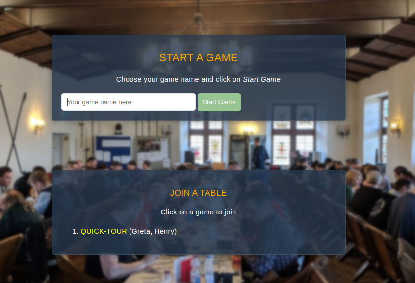

### Joining a game

You can join a game simply by accessing the direct URL or via the list provided on the site's home page (e.g. ``localhost:8080/``)

Once you chose a username and a deck, you will be redirected to a lobby. There, you will have to wait until the table's *host* grants you access to the table. All you have to do is wait there.

### Entering the game table

You will be asked if you want to start the audio chat. This is not supported at the moment but would simply open another browser tab and load the meetings url.

#### A first look

When you enter the table, you will be greeted with an introduction popup telling you about chat opportunites and the drag and drop gameplay.

Once closed, the table will look like this:
                
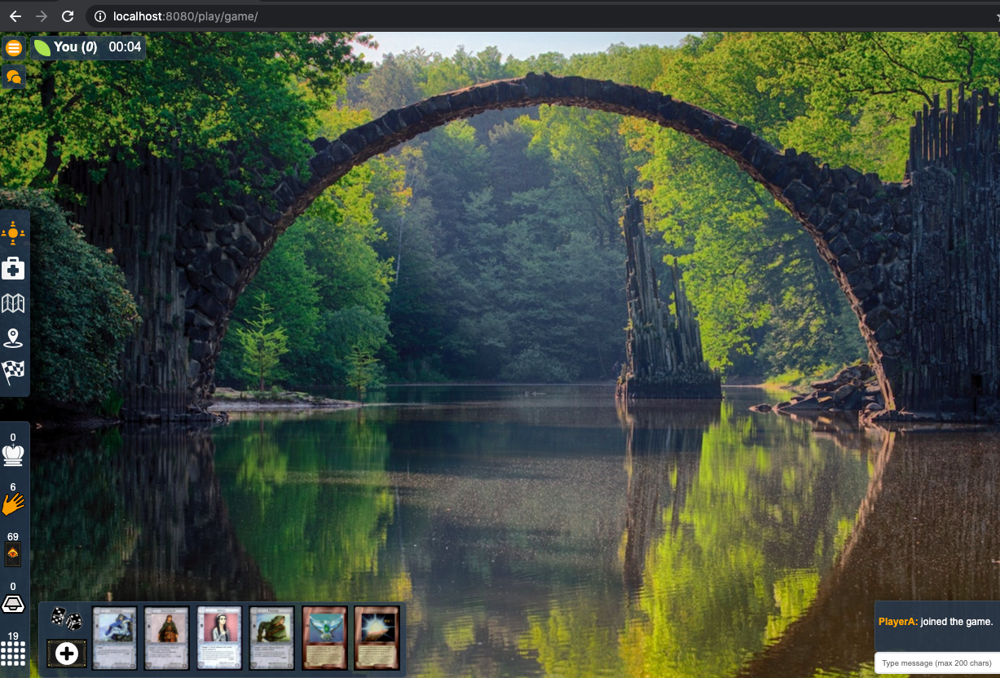

The upper left corner shows the players at this table. The active player is highlighted in bold. Next to each player is the card number in hand once the first organisation phase starts.

#### Playing Cards

Playing cards works via *drag & drop*. Once you drag the card, target drop zones will appear where you can drop the respective card.

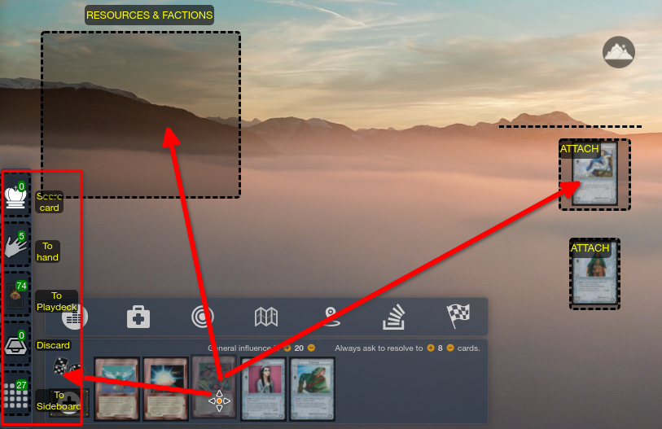

You can drag the card over each of the drop zones and drop it to put it into play (or to any pile). Each potential drop zone will have a tooltip appearing which indicates the action type.

####  Playing Characters

A character may create a *new company* or *join* an existing company under general influence or follow a character under direct influence. As a player, you have to make sure that the action is legitimate, i.e. there is enough general or direct influence available.

Splitting and reoganizing companies is easy as well. Simply drag the character and perform the action. If they have followers, they will continue to follow as well.

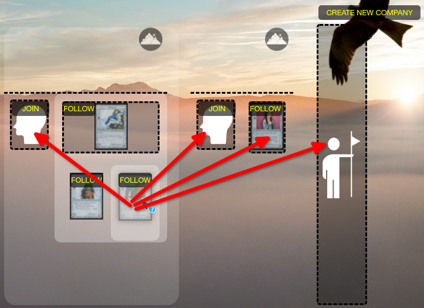

In this example, a character may join its current company under general influence, join another company either under direct or general influence or split into a separate company.

#### Choosing a start site

A company is indicated by a dotted line, above which there is a mountain icon. Clicking on this will open the map where hyou can select your home site.

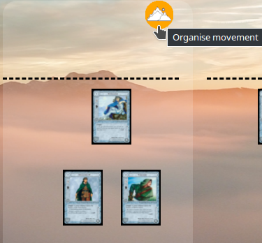

The map will appear with red markers on it. Such a marker is called a region marker. Clicking on it will show all available sites in that region. Clicking on such a site will automatically set it as starting site.


After having clicked on the site, the map window closes and the site is set.


#### Planning your movement

To plan your movement, click on the mountain icon again to open the map. Similar to start site selection, choose your target site.


The sitepath will have to be chosen manually. To do so, click on a region and add it to the sitepath. To remove it again, click on the card in the sitepath.

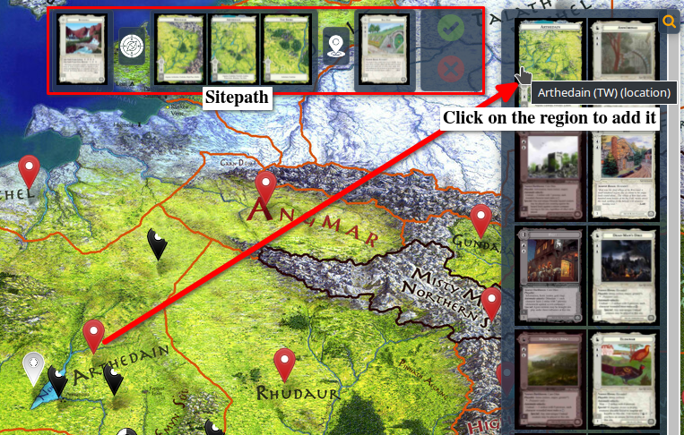

To confirm this movement, click on the green icon and close the winodw again.
To reval the movement to your opponent, click on the "eye" icon.


#### Playing Hazards

Hazards can be either events or creatures. Usually, events are added to the staging area.

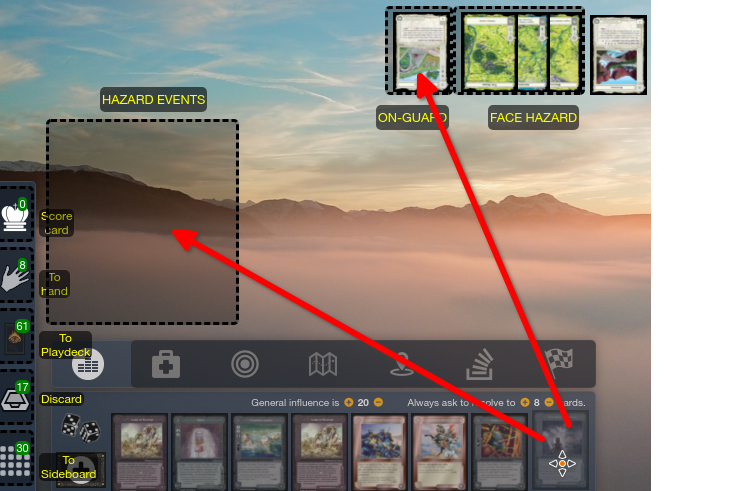

Hazards may also be attached to a specific chraracter, e.g. corruption cards.

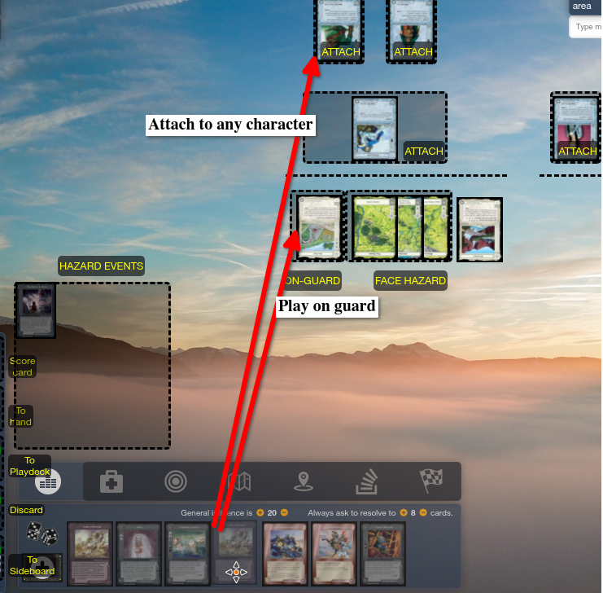

To force a company or character to face hazard, drop it onto the regions and it will appear next to the site.

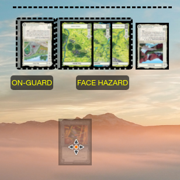

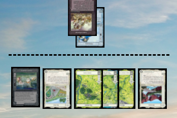

If you want to play a card "on guard", simply drop it onto the destiation site and it will appear face fown.

#### Obtaining Marshalling Points

To obtain marshalling points, simply drag a card onto your vicotry pile.


This will open a window that lets you choose the category and amount of points.

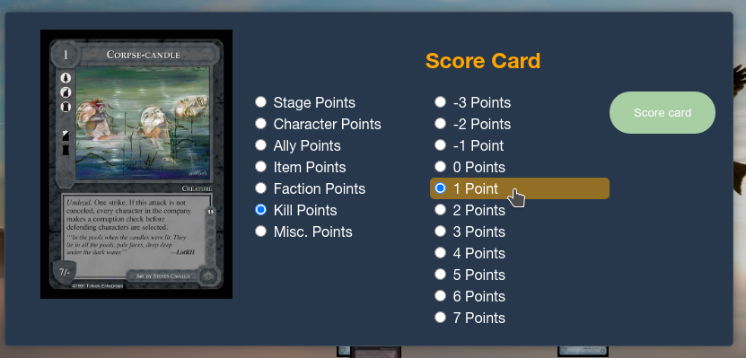

#### No more hazards

You can signal the end of your hazard play against a company by right clicking on the target site and choosing the respective action.

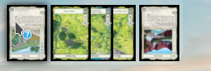

This action will reduce the sitepath to the destiation site only. On guard cards will be kept attached to the site.

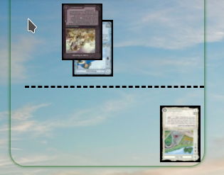

#### Updating your scores

Click on the victory pile icon to open the score sheet.


You can change your points at any time during the game.

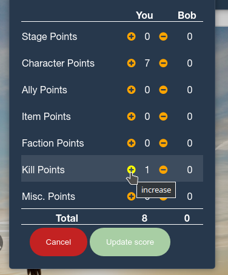

#### Tapping Cards and Sites

To alter the card state, hover over the card and wait for the cursor to change. A question mark indicates a right click action to be available.


The context menu provides all available actions.


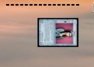


#### Reshuffle discard pile into playdeck

The discard pile will be reshuffled automatically once your playdeck is out of cards. You do not need to do this yourself.

#### Shortcuts

The following shortcuts are available:

* `r` to roll the dice
* `d` to draw a card
* `Doubleclick` to tap a card
* `Doubleclick`+`ALT` to untap a card
* `Doubleclick`+`CTRL` to highlight card for 5 seconds

#### Troubleshooting

* Sometimes you may not hit the drop zone to play a card. Just retry.
* You may reload the page if it seems necessary.
* Open the browsers inspection tool console to check for errors. This should usually not happen but you never know. Chrome's shortcut is `CTRL+SHIFT+J`

#### Game Options

You can access certain options via the options icon.

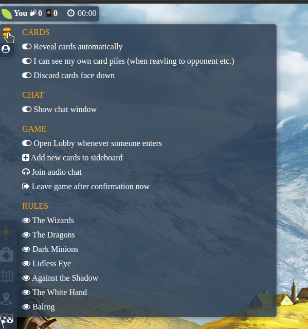

#### Revealing cards to your opponent

You can reveal cards to your opponent by opening the respective pile and selecting the action at the top of the box.


#### Empty play deck

If you are out of cards, simply draw a new card. All cards from you discard pile will be added to your play deck and are reshuffled automatically.

#### Organisation Phase / Scoring cards

To store cards, move them to your marshaling points pile. A popup will ask you to specify how (and if) this card should be stored.

#### Finishing the Game

You can finish the game via the game preferences menu (see above). This will automatically bring up a score sheet with the oval results.

The game will end automatically.

## Arda Gameplay

The Arda gameplay differes from the standard games a bit. The rules will not be discussed.

### Starting an Arda Game

Simply choose an arda deck from the right deck offerings (or provide your own deck) and check the "Arda game type" checkbox.

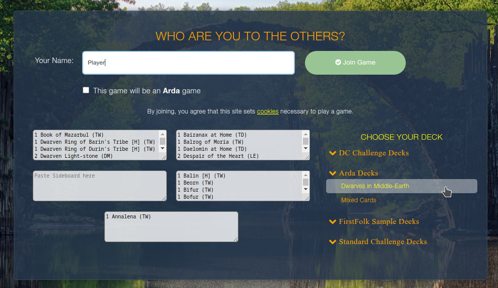

### Character Draft

Once all players have joined the table (see below) you can randomly assign the 10 starting characters by clicking on the respective box at the right of the screen.

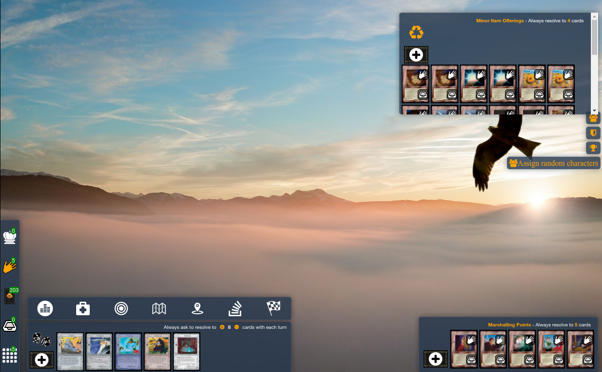

This option is only available once!

Clicking on this option adds 10 characters to each players hand according to the Arda mechanism. After you have picked your cards, please *discard* the other characters by dragging and dopping them on the discard icon at the right next to your hand.

### Minro Item Draft

Now each player picks their minor items from the minor item offering deck. 

### Starting the Game

To put all characters and minor items back into the playdeck and get a random number of cards, click on the recycle icon above the deck's "Draw Card" icon. 

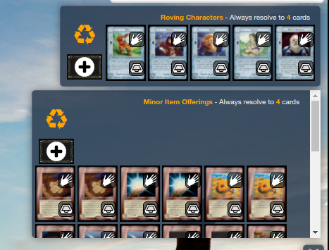

### Joining an Arda Game

To join an Arda game, simply click on the game from the game list.


You will be asked to provide only a user name so your fellow players know who you are. The game host will receive a message with your request to join. Once that is granted you will proceed to the table automatically.

### Granting Access

Whenever a player wants to join the table, you will receive a notification and the option to grant or deny access. You will receive a notification once the player has successfully joined the table.


## Dependencies

Of cource, this project would not be possible without the work of others, and credit should be given.

### Third Party Libraries

The following third-party libraries. Be aware of their respective licenses.

* Node.JS - Socket.io 4.0.0 (MIT License)
* Node.JS - Express 4.17.1 (MIT License)
* Node.JS - Express cookie-parser 1.4.5 (MIT License)
* jQuery 3.5.1 (MIT License)
* jQuery UI v1.12.1 - 2021-03-20 (widget.js, data.js, scroll-parent.js, widgets/draggable.js, widgets/droppable.js, widgets/mouse.js, MIT License)
* jQuery UI Touch Punch (MIT License)
* leafletjs 1.7.1 (BSD 2-Clause "Simplified" License)

### HTML / CSS 

* Some CSS is taken from https://html5up.net (MIT License)
* The CSS colours and some design ideas were taken from https://github.com/mtgred/netrunner (MIT License)
* Font Awesome Free, see https://fontawesome.com/license/free (Icons: CC BY 4.0, Fonts: SIL OFL 1.1, Code: MIT License)

### Icons and Backgrounds

* All icon licenses are "free for commercial use" with no link back Icons were taken from https://www.iconfinder.com/
* The background image was taken from https://www.pexels.com/ Unfotunately, I cannot remember the link exactly anymore.

## License

All information is given in a dedicated [README_license.md](README_license.md).
